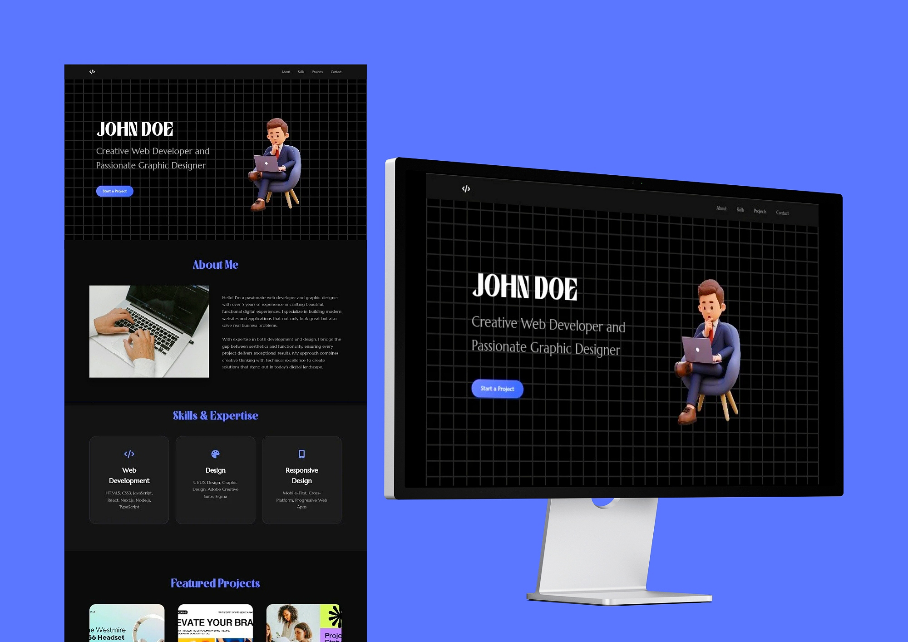

# John Doe Portfolio Website  

This is a simple, clean portfolio template I built. The idea was to create something professional but still approachable where visitors can learn about the person behind the work and get a good sense of their projects and abilities. 

## Tools Used  

- **HTML & CSS**: For structure and styling.  
- **Google Fonts**: To make the typography look polished.  
- **Font Awesome**: For icons that don’t feel outdated.  
- **JavaScript**: Just enough to handle interactivity (like the mobile menu).  

## How It Works  

- **Explore**: Use the nav bar to jump between sections.  
- **Browse Projects**: Each project has its own card with details.  
- **Contact Me**: Fill out the form if you want to start a project or just say hi.  

## Who This Is For  

This template is perfect for freelancers or anyone who wants to build a personal portfolio but doesn’t want to spend hours starting from scratch. It’s simple to customize and ready to go. 

# Credits  

This portfolio template's designed and developed by **JohnDev19**.
See [LICENSE](LICENSE)

---

Feel free to use this template as a starting point and make it your own!  
